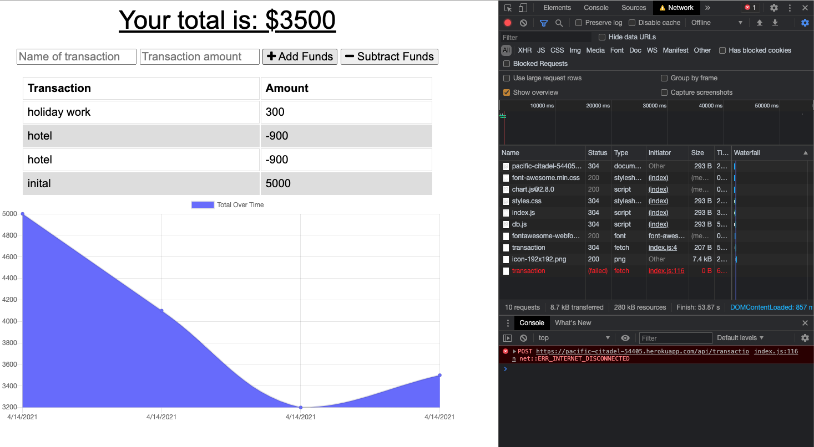
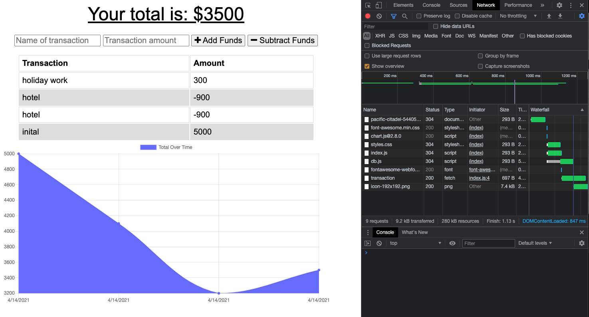
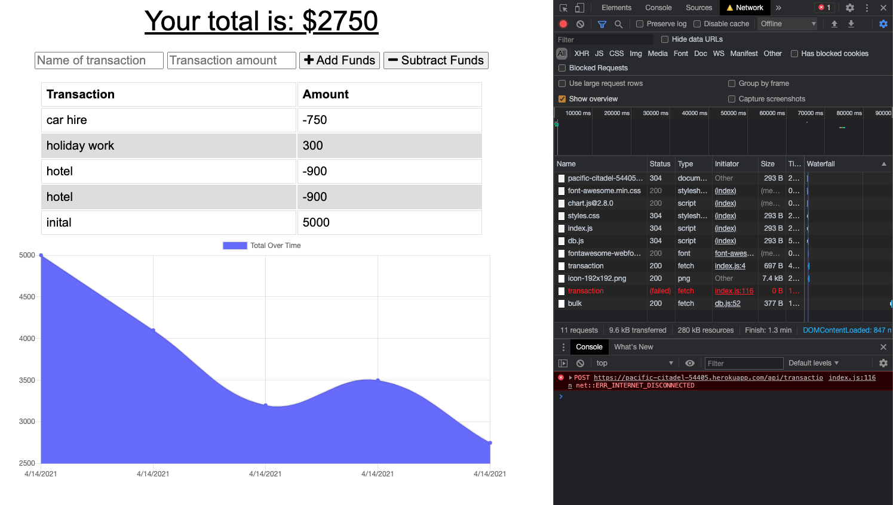
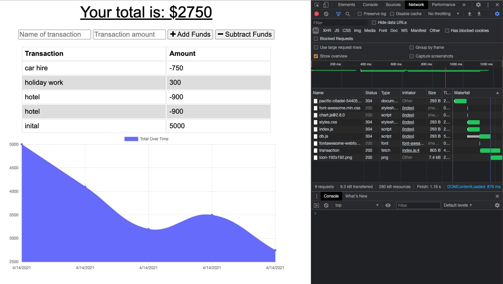

# Online_Offline_Budget_Tracker

This budget tracker allows the user to track their money by adding or deducting expences or income flow with or without connection to the internet.
When transactions are added offline, the total should be updated when brought back online.

[Deployed Heroku Link](https://pacific-citadel-54405.herokuapp.com/)

## Installation

This run this application properly, first we need to make sure that the dependencies are installed before starting the application on the local server. Then create service-worker.js to manage the cache of user input. Lastly, create db.js for building a database and configuring the db behaviour.
This was set to run in  "localhost:3000" in the internet browser after running "node server.js" in your terminal.

To be able to deploy to Heroku, make sure that the application is working perfecetly in local before creating a database in MongoDB Atlas and make sure to connect the new database to Heroku.

## Usage
*[Add funds while application is offlline](assets/Offline.PNG)
 
*[Application went online after adding fund](assets/Online.PNG)
 
*[Subtracting funds during offline](assets/offline_subtract.PNG)
 
*[Funds subtracted after going online](assets/online_subtract.PNG)
 

## Credits
*[Mongodb / Mongo Atlas](https://www.mongodb.com/cloud/atlas/) 
*[Webpack.js.org](https://webpack.js.org/guides/progressive-web-application/) 
*[Express NPM Package](https://www.npmjs.com/package/express)